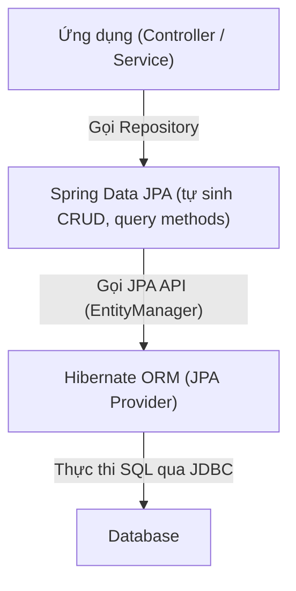

# Spring Boot – Buổi 6: Spring Data JPA & Migration

## 1) Spring Data JPA

### 1.1 Spring Data JPA là gì?

* Là một thư viện của Spring giúp thao tác với Hibernate ORM dễ dàng hơn
* Cung cấp `Repository Interface` giúp CRUD dữ liệu mà **không cần viết SQL hay HQL**

Ví dụ:

```java
List<StudentEntity> students = studentRepository.findAll();
```

→ Spring tự động sinh SQL tương ứng

#### Tóm lại:
> Spring Data JPA = Tự sinh code CRUD + Query </br>
> Hibernate = ORM triển khai JPA, thực thi SQL thật

### 1.2 Luồng tổng quát



> Spring Data JPA được xem là lớp tiện ích để dùng Hibernate dễ hơn

### 1.3 Repository Interface

Trong Spring Data JPA, chỉ cần khai báo interface, Spring sẽ:
* Tự tạo implementation
* Tự sinh code CRUD
* Tự quản lý transaction
* Tự chuyển đổi dữ liệu ORM

> Do đó **không cần viết DAO thủ công** như Hibernate thuần

#### 1.3.1 Cách khai báo Repository

```java
public interface StudentRepository extends JpaRepository<StudentEntity, UUID> {
}
```

> **Cần gán kiểu khi kế thừa JpaRepository**:
> * `StudentEntity`: Entity tương ứng bảng students trong DB
> * `UUID`: Kiểu dữ liệu của khóa chính trong entity

#### 1.3.2 Các tính năng có sẵn từ JpaRepository

| Nhóm             | Method              | Chức năng                |
|------------------|---------------------|--------------------------|
| CRUD             | `save(entity)`      | Insert/Update            |
|                  | `findById(id)`      | Tìm theo ID              |
|                  | `deleteById(id)`    | Xóa theo ID              |
| Truy vấn tất cả  | `findAll()`         | Lấy toàn bộ dữ liệu      |
| Paging & Sorting | `findAll(Pageable)` | Phân trang               |
|                  | `findAll(Sort)`     | Sắp xếp                  |
| Đếm dữ liệu      | `count()`           | Tổng số bản ghi          |
| Check tồn tại    | `existsById(id)`    | Kiểm tra tồn tại bản ghi |

> * Không cần viết code cho các tính năng này
> * Chỉ cần gọi thông qua đối tượng của `StudentRepository` đã kế thừa `JpaRepository`

#### 1.3.3 Mở rộng tính năng với Query Methods

Spring Data JPA sinh SQL theo tên method

```java
List<StudentEntity> findByFullName(String name);
List<StudentEntity> findByAgeGreaterThan(int age);
Optional<StudentEntity> findByEmail(String email);
int countByActiveFalse();
boolean existsByPhone(String phone);
void deleteByAgeLessThan(int age);
```

> **Tên method = Câu query**: chỉ cần tuân theo quy tắc `prefix (findBy, countBy, ...) + FieldName + Condition`<br/>
> **Không cần viết SQL**: Spring Data JPA phân tích tên method → tự sinh SQL tương ứng

##### 1. Các prefix phổ biến trong Query Methods

| Prefix     | Ý nghĩa                      | Ví dụ                     | Ghi chú               |
|------------|------------------------------|---------------------------|-----------------------|
| `findBy`   | Truy vấn và trả về danh sách | `findByEmail(email)`      | Dùng phổ biến nhất    |
| `getBy`    | Giống `findBy`               | `getById(id)`             | Tránh nhầm với getter |
| `countBy`  | Đếm số lượng                 | `countByActiveTrue()`     | Trả về `long`         |
| `existsBy` | Kiểm tra tồn tại             | `existsByEmail(email)`    | Trả về `boolean`      |
| `deleteBy` | Xóa theo điều kiện           | `deleteByAgeLessThan(10)` | Trả về số bản ghi xóa |
| `removeBy` | Xóa giống `deleteBy`         | `removeByEmail(email)`    | Ít dùng               |

##### 2. Các toán tử thường dùng

| Từ khóa         | Ý nghĩa          | Ví dụ method                      | SQL tương đương       |
|-----------------|------------------|-----------------------------------|-----------------------|
| `Is`, `Equals`  | `=`              | `findByAgeEquals(20)`             | age = 20              |
| `Not`           | `!=`             | `findByStatusNot("INACTIVE")`     | status <> 'INACTIVE'  |
| `GreaterThan`   | `>`              | `findByAgeGreaterThan(18)`        | age > 18              |
| `LessThan`      | `<`              | `findByAgeLessThan(10)`           | age < 10              |
| `Between`       | `BETWEEN`        | `findByAgeBetween(18, 30)`        | age BETWEEN 18 AND 30 |
| `Like`          | `LIKE`           | `findByFullNameLike("J%")`        | name LIKE 'J%'        |
| `Containing`    | `LIKE %keyword%` | `findByFullNameContaining("an")`  | LIKE '%an%'           |
| `StartingWith`  | `LIKE keyword%`  | `findByFullNameStartingWith("A")` | LIKE 'A%'             |
| `EndingWith`    | `LIKE %keyword`  | `findByFullNameEndingWith("g")`   | LIKE '%g'             |
| `In`            | `IN (...)`       | `findByIdIn(List<UUID>)`          | id IN (...)           |
| `True`, `False` | `boolean`        | `findByActiveTrue()`              | active = true         |

##### 3. Kết hợp nhiều điều kiện bằng `And`, `Or`

```java
findByFullNameContainingAndAgeGreaterThan(String name, int age);
findByCityOrDistrict(String city, String district);
```

##### 4. Sắp xếp trong tên method

```java
findByAgeGreaterThanOrderByAgeAsc();
findByAgeGreaterThanOrderByFullNameDesc();
```

**Lưu ý**: Tốt nhất vẫn nên dùng `Sort` object để linh hoạt hơn

##### 5. Query với quan hệ Entity

Student có Classroom classroom:

```java
List<StudentEntity> findByClassroomName(String name);
```

→ Auto JOIN theo quan hệ ORM

##### 6. Trả về Optional để tránh NullPointer

```java
Optional<StudentEntity> findByEmail(String email);
```

##### 7. Tránh nhầm lẫn

| Không đúng        | Đúng                                              |
|-------------------|---------------------------------------------------|
| `findByname()`    | `findByName()` → đúng quy tắc PascalCase          |
| `findByfull_name` | `findByFullName` → theo CamelCase property Entity |

##### 8. Các trường hợp không nên dùng Query Methods

| Không phù hợp khi                    | Lý do                                 |
|--------------------------------------|---------------------------------------|
| Query quá phức tạp (JOIN nhiều bảng) | Tên method sẽ rất dài và khó đọc      |
| Dùng nhiều điều kiện tùy chọn        | Dùng `Specifications` (bài sau)       |
| Cần tối ưu hiệu năng đặc biệt        | Viết `@Query` (JPQL/Native) (bài sau) |

---

## 2) Flyway Migration

### 2.1 Khái niệm

> * Flyway giúp **quản lý version DB** bằng file **migration script** (SQL)
> * Mỗi lần thay đổi cấu trúc DB → thêm file migration mới → Flyway tự cập nhật
> * Khi ứng dụng khởi động, Flyway **so khớp version** với bảng `flyway_schema_history` rồi **chạy các migration còn thiếu** theo thứ tự
> * **Quy tắc vàng**: Không chỉnh sửa migration đã chạy
>   * Nếu chỉnh sửa → Flyway kiểm tra cột `checksum` trong bảng `flyway_schema_history` → báo lỗi validation
>   * Cách làm đúng → Tạo migration mới để sửa đổi

----------
### 2.2 Tạo migration scripts

* Path mặc định: `src/main/resources/db/migration/`
* Tên file theo format: `V<version>__<description>.sql`

Ví dụ:

```
V1.0.0__init_student.sql
```

### 3.3 Nội dung file migration

```sql
SET search_path TO app;

CREATE EXTENSION IF NOT EXISTS "pgcrypto";

CREATE SCHEMA IF NOT EXISTS app;

CREATE TABLE IF NOT EXISTS students(
    id UUID PRIMARY KEY DEFAULT gen_random_uuid(),
    full_name VARCHAR(150) NOT NULL,
    email VARCHAR(200) UNIQUE NOT NULL,
    age INT,
    created_at TIMESTAMPTZ NOT NULL DEFAULT NOW(),
    updated_at TIMESTAMPTZ NOT NULL DEFAULT NOW()
);

INSERT INTO students(full_name, email, age)
VALUES
('Nguyễn Văn A', 'a@example.com', 20),
('Trần Thị B',  'b@example.com', 22),
('Lê Văn C',    'c@example.com', 21)
ON CONFLICT (email) DO NOTHING;
```

**Kiểm tra** sau khi chạy app → Flyway tạo bảng `flyway_schema_history` để lưu version

---

## 4) Thực hành CRUD với Spring Data JPA

### 4.1 Entity Sample

```java
@Entity
@Table(name = "classroom")
@Data
@NoArgsConstructor
@AllArgsConstructor
@Builder
public class Classroom {
    @Id
    @GeneratedValue(strategy = GenerationType.UUID)
    private UUID id;

    @Column(nullable = false)
    private String name;
}
```

> Tương tự tạo `Student` và `Teacher` cập nhật lại theo cấu trúc mới.

### 4.2 Repository mẫu

```java
@Repository
public interface ClassroomRepository extends JpaRepository<Classroom, UUID> {
    List<Classroom> findByNameContaining(String keyword);
}
```

### 4.3 Service & Controller Demo

```java
@Service
@RequiredArgsConstructor
public class ClassroomService {
    private final ClassroomRepository repo;

    public List<Classroom> getAll() {
        return repo.findAll();
    }
}

@RestController
@RequestMapping("${api.prefix}/classrooms")
@RequiredArgsConstructor
public class ClassroomController {
    private final ClassroomService service;

    @GetMapping
    public ResponseEntity<List<Classroom>> findAll() {
        return ResponseEntity.ok(service.getAll());
    }
}
```

> Gọi thử `GET /api/v1/classrooms` → dữ liệu trả về JSON.

---

## 5) Bài tập thực hành

* Tạo Controller cho `Student` và `Teacher` với JPA Repository.
* API yêu cầu:

    * `GET /students?age>=18` (Query Method)
    * `POST /teachers` (save teacher)
    * `GET /classrooms/{id}/students` → Quan hệ 1–N
* Export Postman Collection.
* So sánh số dòng code giữa JDBC vs Spring Data JPA.

---

## 6) Tổng kết

✅ Không cần viết SQL → JPA tạo tự động.
✅ Flyway quản lý cấu trúc DB bền vững theo thời gian.
✅ Chuẩn bị cho phần nâng cao: **relationships mapping**, **pagination**, **specifications**, **error handling chuẩn RFC 7807**.

Buổi tới: **Mapping quan hệ OneToMany & ManyToOne và viết API nâng cao** ✅
