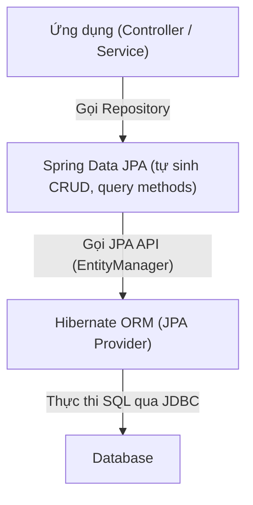

# Spring Boot – Buổi 6: Spring Data JPA & Migration

## 1) Spring Data JPA

### 1.1 Spring Data JPA là gì?

* Là một thư viện của Spring giúp thao tác với Hibernate ORM dễ dàng hơn
* Cung cấp `Repository Interface` giúp CRUD dữ liệu mà **không cần viết SQL hay HQL**

Ví dụ:

```java
List<StudentEntity> students = studentRepository.findAll();
```

→ Spring tự động sinh SQL tương ứng

#### Tóm lại:
> Spring Data JPA = Tự sinh code CRUD + Query </br>
> Hibernate = ORM triển khai JPA, thực thi SQL thật

### 1.2 Luồng tổng quát



> Spring Data JPA được xem là lớp tiện ích để dùng Hibernate dễ hơn

### 1.3 Repository Interface

Trong Spring Data JPA, chỉ cần khai báo interface, Spring sẽ:
* Tự tạo implementation
* Tự sinh code CRUD
* Tự quản lý transaction
* Tự chuyển đổi dữ liệu ORM

> Do đó **không cần viết DAO thủ công** như Hibernate thuần

#### 1.3.1 Cách khai báo Repository

```java
public interface StudentRepository extends JpaRepository<StudentEntity, UUID> {
}
```

> **Cần gán kiểu khi kế thừa JpaRepository**:
> * `StudentEntity`: Entity tương ứng bảng students trong DB
> * `UUID`: Kiểu dữ liệu của khóa chính trong entity

#### 1.3.2 Các tính năng có sẵn từ JpaRepository

| Nhóm             | Method              | Chức năng                |
|------------------|---------------------|--------------------------|
| CRUD             | `save(entity)`      | Insert/Update            |
|                  | `findById(id)`      | Tìm theo ID              |
|                  | `deleteById(id)`    | Xóa theo ID              |
| Truy vấn tất cả  | `findAll()`         | Lấy toàn bộ dữ liệu      |
| Paging & Sorting | `findAll(Pageable)` | Phân trang               |
|                  | `findAll(Sort)`     | Sắp xếp                  |
| Đếm dữ liệu      | `count()`           | Tổng số bản ghi          |
| Check tồn tại    | `existsById(id)`    | Kiểm tra tồn tại bản ghi |

> * Không cần viết code cho các tính năng này
> * Chỉ cần gọi thông qua đối tượng của `StudentRepository` đã kế thừa `JpaRepository`

#### 1.3.3 Mở rộng tính năng với Query Methods

Spring Data JPA sinh SQL theo tên method

```java
List<StudentEntity> findByFullName(String name);
List<StudentEntity> findByAgeGreaterThan(int age);
Optional<StudentEntity> findByEmail(String email);
int countByActiveFalse();
boolean existsByPhone(String phone);
void deleteByAgeLessThan(int age);
```

> **Tên method = Câu query**: chỉ cần tuân theo quy tắc `prefix (findBy, countBy, ...) + FieldName + Condition`<br/>
> **Không cần viết SQL**: Spring Data JPA phân tích tên method → tự sinh SQL tương ứng

##### 1. Các prefix phổ biến trong Query Methods

| Prefix     | Ý nghĩa                      | Ví dụ                     | Ghi chú               |
|------------|------------------------------|---------------------------|-----------------------|
| `findBy`   | Truy vấn và trả về danh sách | `findByEmail(email)`      | Dùng phổ biến nhất    |
| `getBy`    | Giống `findBy`               | `getById(id)`             | Tránh nhầm với getter |
| `countBy`  | Đếm số lượng                 | `countByActiveTrue()`     | Trả về `long`         |
| `existsBy` | Kiểm tra tồn tại             | `existsByEmail(email)`    | Trả về `boolean`      |
| `deleteBy` | Xóa theo điều kiện           | `deleteByAgeLessThan(10)` | Trả về số bản ghi xóa |
| `removeBy` | Xóa giống `deleteBy`         | `removeByEmail(email)`    | Ít dùng               |

##### 2. Các toán tử thường dùng

| Từ khóa         | Ý nghĩa          | Ví dụ method                      | SQL tương đương       |
|-----------------|------------------|-----------------------------------|-----------------------|
| `Is`, `Equals`  | `=`              | `findByAgeEquals(20)`             | age = 20              |
| `Not`           | `!=`             | `findByStatusNot("INACTIVE")`     | status <> 'INACTIVE'  |
| `GreaterThan`   | `>`              | `findByAgeGreaterThan(18)`        | age > 18              |
| `LessThan`      | `<`              | `findByAgeLessThan(10)`           | age < 10              |
| `Between`       | `BETWEEN`        | `findByAgeBetween(18, 30)`        | age BETWEEN 18 AND 30 |
| `Like`          | `LIKE`           | `findByFullNameLike("J%")`        | name LIKE 'J%'        |
| `Containing`    | `LIKE %keyword%` | `findByFullNameContaining("an")`  | LIKE '%an%'           |
| `StartingWith`  | `LIKE keyword%`  | `findByFullNameStartingWith("A")` | LIKE 'A%'             |
| `EndingWith`    | `LIKE %keyword`  | `findByFullNameEndingWith("g")`   | LIKE '%g'             |
| `In`            | `IN (...)`       | `findByIdIn(List<UUID>)`          | id IN (...)           |
| `True`, `False` | `boolean`        | `findByActiveTrue()`              | active = true         |

##### 3. Kết hợp nhiều điều kiện bằng `And`, `Or`

```java
findByFullNameContainingAndAgeGreaterThan(String name, int age);
findByCityOrDistrict(String city, String district);
```

##### 4. Query với điều kiện `IgnoreCase`

Sử dụng `IgnoreCase` để thực hiện so sánh không phân biệt chữ hoa/chữ thường (case-insensitive)

```java
List<Person> findByFullNameContainingIgnoreCase(String name);
```

SQL tương ứng: `WHERE LOWER(full_name) LIKE LOWER('%{name}%')`

##### 5. Sắp xếp trong tên method

```java
findByAgeGreaterThanOrderByAgeAsc();
findByAgeGreaterThanOrderByFullNameDesc();
```

**Lưu ý**: Tốt nhất vẫn nên dùng `Sort` object để linh hoạt hơn

##### 6. Join query với Property Traversal

Khi muốn truy vấn thuộc tính `fullName` của entity được join là `Person`:

```java
List<Student> findByPerson_FullNameContainingIgnoreCase(String keyword);
```

| Phần trong method | Ý nghĩa                      |
|-------------------|------------------------------|
| `findBy`          | Tạo câu truy vấn SELECT      |
| `Person_`         | **JOIN sang bảng Person**    |
| `FullName`        | **Lọc theo cột `full_name`** |
| `Containing`      | LIKE %keyword%               |
| `IgnoreCase`      | Không phân biệt hoa/thường   |

SQL tương ứng:

```sql
SELECT s.*
FROM students s
JOIN people p ON s.person_id = p.id
WHERE LOWER(p.full_name) LIKE LOWER('%keyword%')
```

→ JPA tự động JOIN để **tìm Student theo fullName của Person**

##### 7. Trả về Optional để tránh NullPointer

```java
Optional<StudentEntity> findByEmail(String email);
```

##### 8. Tránh nhầm lẫn

| Không đúng        | Đúng                                              |
|-------------------|---------------------------------------------------|
| `findByname()`    | `findByName()` → đúng quy tắc PascalCase          |
| `findByfull_name` | `findByFullName` → theo CamelCase property Entity |

##### 9. Các trường hợp không nên dùng Query Methods

| Không phù hợp khi                    | Lý do                                 |
|--------------------------------------|---------------------------------------|
| Query quá phức tạp (JOIN nhiều bảng) | Tên method sẽ rất dài và khó đọc      |
| Dùng nhiều điều kiện tùy chọn        | Dùng `Specifications` (bài sau)       |
| Cần tối ưu hiệu năng đặc biệt        | Viết `@Query` (JPQL/Native) (bài sau) |

---

## 2) Flyway Migration

### 2.1 Khái niệm

> * Flyway giúp **quản lý version DB** bằng file **migration script** (SQL)
> * Mỗi lần thay đổi cấu trúc DB → thêm file migration mới → Flyway tự cập nhật
> * Khi ứng dụng khởi động, Flyway **so khớp version** với bảng `flyway_schema_history` rồi **chạy các migration còn thiếu** theo thứ tự
> * **Quy tắc vàng**: Không chỉnh sửa migration đã chạy
>   * Nếu chỉnh sửa → Flyway kiểm tra cột `checksum` trong bảng `flyway_schema_history` → báo lỗi validation
>   * Cách làm đúng → Tạo migration mới để sửa đổi

### 2.2 Cách đặt tên file migration

* Path mặc định: `src/main/resources/db/migration/`
* Tên file theo format: 
  * Versioned: `V<version>__<description>.sql` (ví dụ: `V1.0.0__init_students_table.sql`)
  * Repeatable: `R__<description>.sql` (ví dụ: `R__create_views.sql`) – chạy lại khi checksum thay đổi như `view`, `function`, `materialized view`

### 2.3 Tạo file migration

> Nghiệp vụ yêu cầu:
>   * Cho phép lưu người chưa có tài khoản đăng nhập (ví dụ: import sinh viên mới nhập danh sách nhưng chưa cấp account)
>   * PII (Personally Identifiable Information) cần quản lý tập trung để tránh trùng lặp dữ liệu

#### 2.3.1 Thiết kế DB ban đầu

* **Bảng users**: thông tin tài khoản (dùng để đăng nhập, phân quyền)
  * `id (uuid)`, `username/email (unique toàn hệ thống)`, `password_hash`, `status`, ...
* **Bảng people**: thông tin con người chung
  * `id (uuid)`, `full_name`, `dob`, `address`, `phone/email liên hệ` (có thể khác email đăng nhập)
  * `user_id (nullable)` → một “người” có thể (hoặc chưa) có tài khoản đăng nhập
* **students**: thông tin mở rộng cho tác nhân sinh viên
  * `person_id (PK/FK)`, `student_code`, `enrollment_year`,...

#### 2.3.1 File `db/migration/V1.0.0__init_table_users_people_students.sql` gồm:
  * Khởi tạo bảng `users`, `people`, `students`
  * Trigger tự động gán giá trị `updated_at` mỗi khi UPDATE  

```sql
SET search_path TO app;

CREATE EXTENSION IF NOT EXISTS "pgcrypto";

CREATE SCHEMA IF NOT EXISTS app;

CREATE TABLE IF NOT EXISTS users (
    id UUID PRIMARY KEY DEFAULT gen_random_uuid(),
    username VARCHAR(150) UNIQUE NOT NULL,
    email VARCHAR(200) UNIQUE NOT NULL,
    password_hash TEXT NOT NULL,
    status VARCHAR(30) NOT NULL DEFAULT 'ACTIVE',
    created_at timestamptz NOT NULL DEFAULT now(),
    updated_at timestamptz NOT NULL DEFAULT now()
);

CREATE TABLE IF NOT EXISTS people (
    id UUID PRIMARY KEY DEFAULT gen_random_uuid(),
    full_name VARCHAR(150) NOT NULL,
    dob DATE,
    phone VARCHAR(20) UNIQUE,
    contact_email VARCHAR(200),
    address VARCHAR(255),
    user_id UUID UNIQUE,
    CONSTRAINT fk_people_user FOREIGN KEY (user_id) REFERENCES users(id)
);

CREATE TABLE IF NOT EXISTS students (
    person_id UUID PRIMARY KEY,
    student_code VARCHAR(50) UNIQUE NOT NULL,
    enrollment_year INT,
    CONSTRAINT fk_students_person FOREIGN KEY (person_id) REFERENCES people(id)
);

-- Trigger to set updated_at
CREATE OR REPLACE FUNCTION set_updated_at()
RETURNS trigger AS $$
BEGIN
    NEW.updated_at := NOW();
    RETURN NEW;
END;
$$ LANGUAGE plpgsql;

DROP TRIGGER IF EXISTS trg_users_set_updated_at ON users;
CREATE TRIGGER trg_users_set_updated_at
BEFORE UPDATE ON users
FOR EACH ROW
EXECUTE FUNCTION set_updated_at();
```

#### 2.3.2 File `db/migration/V1.0.1__seed_users_people_students.sql` tạo dữ liệu mock

```sql
SET search_path TO app;

-- USERS
INSERT INTO users (username, email, password_hash, status)
VALUES
('nguyenvanan', 'an.nguyen@example.com', 'hashed_pw_1', 'ACTIVE'),
('tranthibich', 'bich.tran@example.com', 'hashed_pw_2', 'ACTIVE'),
('lehoangcuong', 'cuong.le@example.com', 'hashed_pw_3', 'ACTIVE'),
('phamthidiep', 'diep.pham@example.com', 'hashed_pw_4', 'ACTIVE'),
('vovanem', 'em.vo@example.com', 'hashed_pw_5', 'ACTIVE'),
('nguyenthichau', 'chau.nguyen@example.com', 'hashed_pw_6', 'ACTIVE'),
('giaminhdo', 'gia.do@example.com', 'hashed_pw_7', 'ACTIVE'),
('buithihoa', 'hoa.bui@example.com', 'hashed_pw_8', 'ACTIVE'),
('hoangvankien', 'kien.hoang@example.com', 'hashed_pw_9', 'ACTIVE'),
('phanthilan', 'lan.phan@example.com', 'hashed_pw_10', 'ACTIVE');

-- PEOPLE (lấy user_id dựa trên email)
INSERT INTO people (full_name, dob, phone, contact_email, address, user_id)
SELECT
    ps.full_name, ps.dob, ps.phone, ps.contact_email, ps.address, u.id
FROM (
    VALUES
    ('Nguyen Van An',   DATE '2007-05-12', '0905000001', 'an.nguyen@example.com',    'Hai Chau, Da Nang'),
    ('Tran Thi Bich',   DATE '2003-08-21', '0905000002', 'bich.tran@example.com',    'Hai Chau, Da Nang'),
    ('Le Hoang Cuong',  DATE '2005-02-10', '0905000003', 'cuong.le@example.com',     'Thanh Khe, Da Nang'),
    ('Pham Thi Diep',   DATE '2006-11-03', '0905000004', 'diep.pham@example.com',    'Cam Le, Da Nang'),
    ('Vo Van Em',       DATE '2004-04-19', '0905000005', 'em.vo@example.com',        'Hai Chau, Da Nang'),
    ('Nguyen Thi Chau', DATE '2004-10-09', '0905000006', 'chau.nguyen@example.com',  'Hai Chau, Da Nang'),
    ('Do Minh Gia',     DATE '2008-01-14', '0905000007', 'gia.do@example.com',       'Lien Chieu, Da Nang'),
    ('Bui Thi Hoa',     DATE '2002-12-30', '0905000008', 'hoa.bui@example.com',      'Hai Chau, Da Nang'),
    ('Hoang Van Kien',  DATE '2004-07-08', '0905000009', 'kien.hoang@example.com',   'Thanh Khe, Da Nang'),
    ('Phan Thi Lan',    DATE '2005-03-24', '0905000010', 'lan.phan@example.com',     'Hai Chau, Da Nang')
) AS ps(full_name, dob, phone, contact_email, address)
JOIN users u ON u.email = ps.contact_email;

-- STUDENTS (chỉ một số people là student)
INSERT INTO students (person_id, student_code, enrollment_year)
SELECT
    p.id, ss.student_code, ss.enrollment_year
FROM (
    VALUES
    ('an.nguyen@example.com',   'STU001', 2023),
    ('bich.tran@example.com',   'STU002', 2023),
    ('cuong.le@example.com',    'STU003', 2022),
    ('diep.pham@example.com',   'STU004', 2024),
    ('em.vo@example.com',       'STU005', 2022),
    ('gia.do@example.com',      'STU006', 2024),
    ('kien.hoang@example.com',  'STU007', 2023)
) AS ss(contact_email, student_code, enrollment_year)
JOIN people p ON p.contact_email = ss.contact_email;
```

### 2.4 Kiểm tra

* Sau khi chạy, Flyway tạo bảng `flyway_schema_history` lưu: 
  * version, description, checksum, thời gian chạy, trạng thái
* Có thể dùng pgAdmin hoặc CLI psql để kiểm tra bảng `flyway_schema_history`

```bash
  psql -U app_user -d student_management
  
  #  psql
  select * from flyway_schema_history;
```

### 2.5 Lưu ý thực chiến

> * Không chỉnh sửa file `V__` đã migrate → tạo file mới để thay đổi
> * Đặt seed vào version riêng → có thể tắt seed ở prod khi không cần
> * Hibernate: `ddl-auto=validate`, tuyệt đối tránh `ddl-auto=update` ở prod (ngăn không cho Hibernate tự động chỉnh sửa cấu trúc bảng ở DB theo entity trên Java code)
> * Tách riêng migration cho:
>   * DDL (schema, bảng, trigger)
>   * DML seed (dữ liệu mẫu)
>   * Index/constraint nặng
>   * Repeatable (view/function)

---

## 3) Thực hành CRUD với Spring Data JPA

### 3.1 Entity Person

```java
// student/management/api_app/model/Person.java

@Getter
@Setter
@NoArgsConstructor
@AllArgsConstructor
@Builder
@FieldDefaults(level = AccessLevel.PRIVATE)
@Entity
@Table(name = "people", schema = "app")
public class Person {
    @Id
    @GeneratedValue(strategy = GenerationType.UUID)
    UUID id;

    @Column(name = "full_name", nullable = false, length = FieldLength.NAME_MAX_LENGTH)
    String fullName;

    LocalDate dob;

    @Column(unique = true, length = FieldLength.PHONE_MAX_LENGTH)
    String phone;

    @Column(name = "contact_email", length = FieldLength.EMAIL_MAX_LENGTH)
    String contactEmail;

    @Column(length = FieldLength.ADDRESS_MAX_LENGTH)
    String address;

    @Column(name = "created_at", nullable = false, insertable = false, updatable = false)
    Instant createdAt;

    @Column(name = "updated_at", nullable = false, insertable = false, updatable = false)
    Instant updatedAt;

    // Chưa làm đăng nhập -> chưa dùng entity User -> tạm lược bỏ mapping user_id
}
```

```java
// student/management/api_app/constant/FieldLength.java

public class FieldLength {
    public static final int NAME_MAX_LENGTH = 150;
    public static final int PHONE_MAX_LENGTH = 20;
    public static final int EMAIL_MAX_LENGTH = 200;
    public static final int ADDRESS_MAX_LENGTH = 255;
    public static final int STUDENT_CODE_MAX_LENGTH = 50;
}
```

> * 150, 200, ... là các **magic number**, dễ sai sót khi mỗi nơi nhập số mỗi kiểu
>   * Nên tạo constant `FieldLength.NAME_MAX_LENGTH`, `FieldLength.EMAIL_MAX_LENGTH`, ...

#### Bài tập 1: Viết model `Person` tương ứng với bảng `people`

```java
// student/management/api_app/model/Person.java

// Hãy khai báo các Annotation cần thiết
public class Person {
    
    // Hãy khai báo và cấu hình cho các cột
  
}
```

### 3.2 Nâng cấp entity Students lên JPA

```java
// student/management/api_app/model/Student.java

@Getter
@Setter
@NoArgsConstructor
@AllArgsConstructor
@Builder
@FieldDefaults(level = AccessLevel.PRIVATE)
@Entity
@Table(name = "students", schema = "app")
public class Student {
    @Id
    @Column(name = "person_id")
    UUID id;
  
    @MapsId
    @OneToOne(fetch = FetchType.LAZY, optional = false)
    @JoinColumn(name = "person_id")
    Person person;
  
    @Column(name = "student_code", unique = true, nullable = false, length = FieldLength.STUDENT_CODE_MAX_LENGTH)
    String studentCode;
  
    @Column(name = "enrollment_year")
    Integer enrollmentYear;
  
    @Column(name = "created_at", nullable = false, insertable = false, updatable = false)
    Instant createdAt;
  
    @Column(name = "updated_at", nullable = false, insertable = false, updatable = false)
    Instant updatedAt;
}
```

#### Giải thích mapping entity `Person` vào trong entity `Student`:

> Quan hệ giữa `Person` và `Student` là 1-1, cả 2 bảng `people` và `students` dùng chung khóa chính (`shared primary key`)
> * `@OneToOne(fetch = FetchType.LAZY, optional = false)`: `Student` là chủ mối quan hệ "Mỗi Student liên kết với đúng 1 Person"
>   * `fetch`: có 2 chế độ
>     * `LAZY`: Chỉ tải khi gọi getPerson() ⇒ tối ưu hiệu năng
>     * `EAGER (mặc định)`: Luôn JOIN và tải luôn dữ liệu liên quan
>   * `optional`:
>     * `false`: Quan hệ bắt buộc, FK NOT NULL (`Student` phải có `Person` ⇒ `optional = false`)
>     * `true (mặc định)`: Cho phép bản ghi không có bên còn lại
>   * `mappedBy = "person"`: báo JPA biết FK ở bên `Student` có `@JoinColumn` trên field `person`
>     * Dùng ở phía entity `Person` KHÔNG có `@JoinColumn` 
>     * Ví dụ: `public class Person { @OneToOne(mappedBy = "person") private Student student; }`
>     * JPA KHÔNG tạo FK ở `Person`
>   * `cascade`: thực hiện INSERT/UPDATE/DELETE cho `Student` thì CASCADE luôn cho `Person`
>   * `orphanRemoval`: xóa mồ côi
>     * `true`: Xóa entity phụ `Person` khi không còn được tham chiếu (trong 1-1 ít dùng, nếu không gặp nghiệp vụ đặc biệt)
>     * `false (mặc định)`: thực tế `Person` có thể không được tham chiếu bởi `Student`, nhưng vẫn liên kết với entity khác như `Lecturer` hay `Staff` ... ⇒ không xóa
>
>
> * `@MapsId`: PK của entity này (`Student`) sẽ được lấy từ PK của entity mà nó tham chiếu (`Person`)
>   * `Student` không có ID riêng
>   * `Student` xài chung PK với `Person`
>   * `students.person_id` = `people.id`
>   * Nếu không có `@MapsId` ở `Person person;` JPA sẽ yêu cầu phải tự set `student.id` thủ công, dẫn đến:
>     * `Student` có thể tạo ra ID khác với `Person` → conflict ràng buộc ở DB
>     * Không thể đảm bảo 1–1 chặt chẽ
>  
> 
> * `@JoinColumn(name = "person_id")`: Cột FK trong `students` là `person_id`
>   * Mặc định sẽ nối đến cột PK của entity muốn nối đến (ở đây là `Person`)
>   * `referencedColumnName`: không dùng mặc định nối đến cột PK mà muốn nối đến cột được chỉ định
>     * Ví dụ: `@JoinColumn(name = "email", referencedColumnName = "contact_email")` (thực tế ít khi join theo email)


#### Lưu ý khác:

> * Không nên để business logic trong `Entity` → nên đưa lên tầng `Service`
> * Loại bỏ `onCreate()` và `onUpdate()` vì DB đã để đảm nhận việc gán giá trị cho `created_at` và `updated_at`

#### Bài tập 2: Viết model `Student` tương ứng với bảng `students`

```java
// student/management/api_app/model/Student.java

// Hãy khai báo các Annotation cần thiết
public class Student {
    
    // Hãy khai báo và cấu hình cho các cột
  
}
```

### 3.3 Person Repository

```java
// student/management/api_app/repository/PersonRepository.java

@Repository
public interface PersonRepository extends JpaRepository<Person, UUID> {
    List<Person> findByFullNameContainingIgnoreCase(String keyword);
  
    Optional<Person> findByPhone(String phone);
    boolean existsByPhone(String phone);
  
    List<Person> findByContactEmailIgnoreCase(String email);
}
```

### 3.4 Nâng cấp Student Repository lên Spring Data JPA

```java
// student/management/api_app/repository/StudentRepository.java

@Repository
public interface StudentRepository extends JpaRepository<Student, UUID> {
    Optional<Student> findByStudentCode(String studentCode);
    boolean existsByStudentCode(String studentCode);

    List<Student> findByEnrollmentYear(Integer enrollmentYear);
    
    List<Student> findByPerson_FullNameContainingIgnoreCase(String keyword);
}
```

#### Bài tập 3: Viết `PersonRepository` và `StudentRepository`

* `PersonRepository`: Hãy viết các method để
  * Tìm người theo tên (tìm gần đúng và không phân biệt hoa thường)
  * Tìm người theo số điện thoại
  * Kiểm tra số điện thoại có tồn tại
  * Tìm người theo email liên hệ (không phân biệt hoa thường) 
  * Kiểm tra email liên hệ có tồn tại (không phân biệt hoa thường)

```java
// student/management/api_app/repository/PersonRepository.java

@Repository
public interface PersonRepository extends JpaRepository<Person, UUID> {

    // Hãy viết các method theo yêu cầu nghiệp vụ
    
}
```

* `StudentRepository`: Hãy viết các method để
  * Tìm học viên theo mã học viên
  * Kiểm tra mã học viên có tồn tại
  * Tìm học viên theo năm nhập học
  * Tìm học viên theo tên (tìm gần đúng và không phân biệt hoa thường) 

```java
// student/management/api_app/repository/StudentRepository.java

@Repository
public interface StudentRepository extends JpaRepository<Student, UUID> {
    
    // Hãy viết các method theo yêu cầu nghiệp vụ
  
}
```

### 3.5 Person DTO

* Person Create Request

```java
// student/management/api_app/dto/person/PersonCreateRequest.java

public record PersonCreateRequest(
        String fullName,
        LocalDate dob,
        String phone,
        String contactEmail,
        String address
) {
}
```

* Person Partial Update (PATCH) Request
  * Update một phần, không bắt buộc phải update toàn bộ các field → cho phép client chỉ gửi 1 hoặc vài field cần update  
  * Sử dụng `JsonNullable` của thư viện `org.openapitools` để phân biệt (ví dụ có gửi field "phone" không):

    | JSON client gửi                | isPresent() | orElse(null)   | Ý nghĩa nghiệp vụ                          |
    |--------------------------------|-------------|----------------|--------------------------------------------|
    | `{}` (không gửi field "phone") | `false`     | `null`         | Không cập nhật field (giữ nguyên phone cũ) |
    | `{"phone": null}`              | `true`      | `null`         | Xóa phone                                  |
    | `{"phone": ""}`                | `true`      | `""`           | Cập nhật thành rỗng (tuỳ normalize)        |
    | `{"phone": "0123456789"}`      | `true`      | `"0123456789"` | Cập nhật phone mới                         |

Thêm dependency vào build.gradle:

```groovy
implementation 'org.openapitools:jackson-databind-nullable:0.2.6'
```    

Cấu hình Jackson cho JsonNullable<T>:

```java
// student/management/api_app/configs/JacksonConfig.java

import com.fasterxml.jackson.databind.Module;
import org.openapitools.jackson.nullable.JsonNullableModule;
import org.springframework.context.annotation.Bean;
import org.springframework.context.annotation.Configuration;

@Configuration
public class JacksonConfig {
  @Bean
  public Module jsonNullableModule() {
    return new JsonNullableModule();
  }
}
```

Sử dụng JsonNullable<T> trong request DTO:

```java
// student/management/api_app/dto/person/PersonPatchRequest.java

@Schema(description = "PATCH: Only include fields that need to be updated. Send 'null' to clear a field.")
public record PersonPatchRequest(
        @Schema(type = "string", nullable = true, description = "New full name, cannot be null")
        JsonNullable<String> fullName,

        @Schema(type = "date", nullable = true, description = "New dob, or set null to clear")
        JsonNullable<LocalDate> dob,

        @Schema(type = "string", nullable = true, description = "New phone, or set null to clear")
        JsonNullable<String> phone,

        @Schema(type = "string", nullable = true, description = "New contact email, or set null to clear")
        JsonNullable<String> contactEmail,

        @Schema(type = "string", nullable = true, description = "New address, or set null to clear")
        JsonNullable<String> address
) {
}
```

> `@Schema`: Cấu hình cho Schema `PersonPatchRequest` trên Swagger UI

* List Item Person Response (payload nhẹ, dùng cho trang list item)

```java
// student/management/api_app/dto/person/PersonListItemResponse.java

public record PersonListItemResponse(
        UUID id,
        String fullName,
        String contactEmail,
        Boolean isAdult
) {
}
```

* Detail Person Response (dùng cho trang Detail, Profile của từng Student)

```java
// student/management/api_app/dto/person/PersonDetailResponse.java

public record PersonDetailResponse(
        UUID id,
        String fullName,
        LocalDate dob,
        String phone,
        String contactEmail,
        String address,
        boolean isAdult,
        Instant createdAt,
        Instant updatedAt
) {
}
```

### 3.6 Student DTO

* Student Create Request

```java
// student/management/api_app/dto/student/StudentCreateRequest.java

public record StudentCreateRequest(
        PersonCreateRequest person,
        StudentCreateOnlyRequest student
) {
}
```

* Student Create Only Request

```java
// student/management/api_app/dto/student/StudentCreateOnlyRequest.java

public record StudentCreateOnlyRequest(
        String studentCode,
        Integer enrollmentYear
) {
}
```

* Student Create From Person Request (dùng khi tạo Student từ Person đã tồn tại)

```java
// student/management/api_app/dto/student/StudentCreateFromPersonRequest.java

public record StudentCreateFromPersonRequest(
        UUID personId,
        String studentCode,
        Integer enrollmentYear
) {
}
```

* Student Partial Update (PATCH) Request

```java
// student/management/api_app/dto/student/StudentPatchRequest.java

@Schema(description = "PATCH: Only include fields that need to be updated. Send 'null' to clear a field.")
public record StudentPatchRequest(
        @Schema(type = "string", nullable = true, description = "New student code, cannot be null")
        JsonNullable<String> studentCode,

        @Schema(type = "integer", nullable = true, description = "New enrollment year, or set null to clear")
        JsonNullable<Integer> enrollmentYear
) {
}
```

* List Item Student Response (payload nhẹ, dùng cho trang list item)

```java
// student/management/api_app/dto/student/StudentListItemResponse.java

public record StudentListItemResponse(
        UUID id,
        String studentCode,
        Integer enrollmentYear,
        String fullName,
        String contactEmail,
        Boolean isAdult
) {
}
```

* Student Detail Response (dùng cho trang Detail, Profile của từng Student)

```java
// student/management/api_app/dto/student/StudentDetailResponse.java

public record StudentDetailResponse(
        PersonDetailResponse personDetail,

        String studentCode,
        Integer enrollmentYear,
        Instant createdAt,
        Instant updatedAt
) {
}
```

### 3.7 Mapper thủ công

* Mapper cho entity `Person`:

```java
// student/management/api_app/mapper/PersonMapper.java

@Component
public class PersonMapper {
    public PersonListItemResponse toListItemResponse(Person p) {
        return new PersonListItemResponse(
                p.getId(),
                p.getFullName(),
                p.getContactEmail(),
                AgeCalculator.isAdult(p.getDob())
        );
    }

    public PersonDetailResponse toDetailResponse(Person p) {
        return new PersonDetailResponse(
                p.getId(),
                p.getFullName(),
                p.getDob(),
                p.getPhone(),
                p.getContactEmail(),
                p.getAddress(),
                AgeCalculator.isAdult(p.getDob()),
                p.getCreatedAt(),
                p.getUpdatedAt()
        );
    }
}
```

* Mapper cho entity `Student`:

```java
// student/management/api_app/mapper/StudentMapper.java

@RequiredArgsConstructor
@Component
public class StudentMapper {
    private final PersonMapper personMapper;

    public StudentDetailResponse toDetailResponse(Student s) {
        return new StudentDetailResponse(
                personMapper.toDetailResponse(s.getPerson()),
                s.getStudentCode(),
                s.getEnrollmentYear(),
                s.getCreatedAt(),
                s.getUpdatedAt()
        );
    }

    public StudentListItemResponse toListItemResponse(Student s) {
        Person p = s.getPerson();

        return new StudentListItemResponse(
                s.getId(),
                s.getStudentCode(),
                s.getEnrollmentYear(),
                p.getFullName(),
                p.getContactEmail(),
                AgeCalculator.isAdult(p.getDob())
        );
    }
}
```

#### Bài tập 4: Viết `PersonMapper` và `StudentMapper`

* Hãy viết `PersonMapper` hoàn chỉnh

```java
// student/management/api_app/mapper/PersonMapper.java

// Hãy khai báo Annotation cần thiết
public class PersonMapper {
    public PersonListItemResponse toListItemResponse(Person p) {
        // Hãy hoàn thiện code
    }

    public PersonDetailResponse toDetailResponse(Person p) {
        // Hãy hoàn thiện code
    }
}
```

* Hãy viết `StudentMapper` hoàn chỉnh

```java
// student/management/api_app/mapper/StudentMapper.java

// Hãy khai báo Annotation cần thiết
public class StudentMapper {
    private final PersonMapper personMapper;

    public StudentDetailResponse toDetailResponse(Student s) {
        // Hãy hoàn thiện code
    }

    public StudentListItemResponse toListItemResponse(Student s) {
        // Hãy hoàn thiện code
    }
}

```

### 3.9 Utils

> Tạo các util methods để tăng tính tái sử dụng, tránh lặp code (DRY) 

* Util tính tuổi:

```java
// student/management/api_app/util/AgeCalculator.java

public class AgeCalculator {
    private AgeCalculator() {}

    public static boolean isAdult(LocalDate dob) {
        if (dob == null) return false;
        return Period.between(dob, LocalDate.now()).getYears() >= 18;
    }
}
```

* Util chuẩn hóa String:

```java
// student/management/api_app/util/NormalizerUtil.java

public class NormalizerUtil {
    private NormalizerUtil() {}
    
    public static String trimToNull(String s) {
        return (s == null || s.isBlank()) ? null : s.trim();
    }
    
    public static String normalizeEmail(String s) {
        String v = trimToNull(s);
        return (v == null) ? null : v.toLowerCase();
    }
    
    public static String normalizePhone(String s) {
        String v = trimToNull(s);
        return (v == null)
                ? null
                // Loại bỏ khoảng trắng và dấu ngăn cách
                : v.replaceAll("[\\s.\\-]", "");
    }
    
    public static String normalizeCode(String s) {
        String v = trimToNull(s);
        return v == null ? null : v.toUpperCase();
    }
}
```

### 3.10 Person Service

* `Interface IPersonService`
  * Dễ mock khi viết Unit Test: Mockito chỉ cần mock interface, không mock final class
  * Controller không phụ thuộc class service implementation

```java
// student/management/api_app/service/IPersonService.java

public interface IPersonService {
    List<PersonListItemResponse> getAll();
    List<PersonListItemResponse> searchByName(String keyword);
    List<PersonListItemResponse> searchByContactEmail(String email);
    List<PersonListItemResponse> listByIds(Collection<UUID> ids);
    
    PersonDetailResponse getById(UUID id);
    PersonDetailResponse getByPhone(String phone);
    
    PersonDetailResponse create(PersonCreateRequest request);
    PersonDetailResponse update(UUID id, PersonUpdateRequest request);
    void deleteById(UUID id);
}
```

* Implement Service Class

```java
// student/management/api_app/service/impl/PersonService.java

@Service
@RequiredArgsConstructor
public class PersonService implements IPersonService {
    private final PersonRepository repo;
    private final PersonMapper mapper;

    @PersistenceContext
    private EntityManager entityManager;

    @Transactional(readOnly = true)
    @Override
    public List<PersonListItemResponse> getAll() {
        return repo.findAll()
                .stream()
                .map(mapper::toListItemResponse)
                .toList();
    }

    @Transactional(readOnly = true)
    @Override
    public List<PersonListItemResponse> searchByName(String keyword) {
        String kw = NormalizerUtil.trimToNull(keyword);
        if (kw == null) return List.of();
        return repo.findByFullNameContainingIgnoreCase(kw)
                .stream()
                .map(mapper::toListItemResponse)
                .toList();
    }

    @Transactional(readOnly = true)
    @Override
    public List<PersonListItemResponse> searchByContactEmail(String email) {
        String normalized = NormalizerUtil.normalizeEmail(email);
        if (normalized == null) {
            throw new ResponseStatusException(HttpStatus.BAD_REQUEST, "Email is required");
        }

        return repo.findByContactEmailIgnoreCase(normalized)
                .stream()
                .map(mapper::toListItemResponse)
                .toList();
    }

    @Transactional(readOnly = true)
    @Override
    public List<PersonListItemResponse> listByIds(Collection<UUID> ids) {
        if (ids == null || ids.isEmpty()) return List.of();
        Set<UUID> distinctIds = ids.stream()
                .filter(Objects::nonNull)
                .collect(Collectors.toSet());

        return repo.findAllById(distinctIds).stream()
                .map(mapper::toListItemResponse)
                .toList();
    }

    @Transactional(readOnly = true)
    @Override
    public PersonDetailResponse getById(UUID id) {
        return repo.findById(id)
                .map(mapper::toDetailResponse)
                .orElseThrow(() -> new ResponseStatusException(
                        HttpStatus.NOT_FOUND, "Person not found with id: " + id
                ));
    }

    @Transactional(readOnly = true)
    @Override
    public PersonDetailResponse getByPhone(String phone) {
        String normalized = NormalizerUtil.normalizePhone(phone);
        if (normalized == null) {
            throw new ResponseStatusException(HttpStatus.BAD_REQUEST, "Phone is required");
        }

        return repo.findByPhone(normalized)
                .map(mapper::toDetailResponse)
                .orElseThrow(() -> new ResponseStatusException(
                        HttpStatus.NOT_FOUND, "Person not found with phone: " + phone
                ));
    }

    @Transactional
    @Override
    public PersonDetailResponse create(PersonCreateRequest req) {
        String fullName = NormalizerUtil.trimToNull(req.fullName());
        String phone = NormalizerUtil.normalizePhone(req.phone());
        String email = NormalizerUtil.normalizeEmail(req.contactEmail());
        String address = NormalizerUtil.trimToNull(req.address());

        if (fullName == null) {
            throw new ResponseStatusException(HttpStatus.BAD_REQUEST, "FullName is required");
        }
        if (phone != null) {
            if (repo.existsByPhone(phone)) {
                throw new ResponseStatusException(
                        HttpStatus.CONFLICT, "Phone " + phone + " is existed");
            }
        }

        Person p = Person.builder()
                .fullName(fullName)
                .dob(req.dob())
                .phone(phone)
                .contactEmail(email)
                .address(address)
                .build();

        try {
            repo.saveAndFlush(p);
            entityManager.refresh(p);
        } catch (DataIntegrityViolationException e) {
            // Bắt race condition từ ràng buộc UNIQUE ở DB
            // khoảng giữa repo.existsByPhone() và save() vẫn có thể bị request khác làm thay đổi data
            throw new ResponseStatusException(HttpStatus.CONFLICT, "Unique constraint violated in DB", e);
        }

        return mapper.toDetailResponse(p);
    }

    @Transactional
    @Override
    public PersonDetailResponse patch(UUID id, PersonPatchRequest req) {
        Person p = repo.findById(id)
                .orElseThrow(() -> new ResponseStatusException(
                        HttpStatus.NOT_FOUND, "Person not found with id: " + id
                ));

        if (req.fullName().isPresent()) { // field "fullName" xuất hiện trong request JSON
            String raw = req.fullName()
                    .orElse(null); // request JSON {"fullName": null} thì .orElse(null) trả về null
            if (raw == null) { // Cấm xóa fullName (vì DB có ràng buộc NOT NULL)
                throw new ResponseStatusException(HttpStatus.BAD_REQUEST, "FullName cannot be null");
            }
            String newValue = NormalizerUtil.trimToNull(raw);
            if (newValue == null) { // Field "fullName" của request JSON có value nhưng không hợp lệ (chỉ có space)
                throw new ResponseStatusException(HttpStatus.BAD_REQUEST, "FullName is required");
            }
            p.setFullName(newValue);
        }

        if (req.dob().isPresent()) {
            p.setDob(req.dob() // Có value thì set value đó
                    .orElse(null)); // Value là null thì set null -> xóa dob
        }


        if (req.phone().isPresent()) {
            String raw = req.phone().orElse(null);
            String newPhone = raw != null ? NormalizerUtil.normalizePhone(raw) : null;
            if (newPhone != null && !newPhone.equals(p.getPhone())) {
                if (repo.existsByPhone(newPhone)) {
                    throw new ResponseStatusException(
                            HttpStatus.CONFLICT, "Phone " + newPhone + " is existed");
                }
            }
            p.setPhone(newPhone); // null => xóa phone
        }

        if (req.contactEmail().isPresent()) {
            String raw = req.contactEmail().orElse(null);
            String newEmail = raw != null ? NormalizerUtil.normalizeEmail(raw) : null;
            p.setContactEmail(newEmail); // null => xóa email
        }

        if (req.address().isPresent()) {
            String raw = req.address().orElse(null);
            String newAddress = raw != null ? NormalizerUtil.trimToNull(raw) : null;
            p.setAddress(newAddress); // null => xóa address
        }

        try {
            repo.saveAndFlush(p);
            entityManager.refresh(p);
        } catch (DataIntegrityViolationException e) {
            throw new ResponseStatusException(
                    HttpStatus.CONFLICT, "Unique constraint violated in DB", e);
        }

        return mapper.toDetailResponse(p);
    }

    @Transactional
    @Override
    public void deleteById(UUID id) {
        Person p = repo.findById(id)
                .orElseThrow(() -> new ResponseStatusException(
                        HttpStatus.NOT_FOUND, "Person not found with id: " + id));

        repo.delete(p);
    }
}
```

#### Giải thích trường hợp `Service` **trả kết quả rỗng** theo chuẩn REST API

> * Get detail endpoint (`GET /persons/by-email/{email}`): tìm kiếm duy nhất (id, phone ...) → cần ném `404 Not Found`
> * Search/list endpoint (`GET /persons?email=abc@xyz`): tìm kiếm danh sách (từ khóa, query params ...) → trả 200 với list rỗng bình thường

#### Giải thích Annotation và các method

> * `@Transactional`: annotation giúp Spring quản lý Transaction tự động (không cần BEGIN, COMMIT, ROLLBACK thủ công)
>   * `readOnly = true`: báo Hibernate biết transaction này chỉ phục vụ đọc dữ liệu, không có thay đổi nào xuống DB → tối ưu hiệu năng
> * `@PersistenceContext`: cơ chế đặc biệt để inject EntityManager gắn với transaction hiện tại
> * `EntityManager`: interface của JPA dùng để quản lý transaction, Entity và trạng thái
>   * `refresh()` (không có ở JpaRepository): lấy lại dữ liệu mới nhất do DB gán tự động (`created_at`/`updated_at`) 
> * `listByIds(Collection<UUID> ids)`: dùng Collection<UUID> để nhận được cả Set, List, bất kỳ Collection nào chứa ids
>   * `.filter(Objects::nonNull)`: dùng filter() của Stream để lọc giữ lại các phần tử không null
>     * `filter()` cần truyền vào 1 `Predicate` (lambda: `id -> id != null`)
>     * `Objects::nonNull`: có thể dùng method `nonNull()` của util class Objects để code gọn hơn
>   * `.collect(Collectors.toSet())`: Thu thập kết quả vào Set → tự loại bỏ phần tử trùng lặp
>     * Stream không có `toSet()` như `toList()`
>     * `Collectors.toSet()`: để thu thập kết quả vào Set và trả về `HashSet` (thứ tự không đảm bảo)
>     * `Collectors.toCollection(LinkedHashSet::new)`: trả về `LinkedHashSet` (giữ thứ tự phần tử theo thứ tự stream)
>     * `Collectors.toCollection(TreeSet::new)`: trả về `TreeSet` (tự động sort phần tử)

#### Bài tập 5: Viết `IPersonService` và `PersonService`

* Hãy viết `IPersonService` hoàn chỉnh

```java
// student/management/api_app/service/IPersonService.java

public interface IPersonService {
    
    // Hãy khai báo các abstract method
  
}
```

* Hãy viết `PersonService` hoàn chỉnh

```java
// student/management/api_app/service/impl/PersonService.java

// Hãy khai báo Annotation cần thiết
public class PersonService implements IPersonService {
    private final PersonRepository repo;

    @PersistenceContext
    private EntityManager entityManager;

    // Hãy khai báo Annotation cần thiết
    @Override
    public List<PersonListItemResponse> getAll() {
      
        // Hãy hoàn thiện code
      
    }

    // Hãy khai báo Annotation cần thiết
    @Override
    public List<PersonListItemResponse> searchByName(String keyword) {
      
        // Hãy hoàn thiện code
      
    }

    // Hãy khai báo Annotation cần thiết
    @Override
    public List<PersonListItemResponse> searchByContactEmail(String email) {
      
        // Hãy hoàn thiện code
      
    }

    // Hãy khai báo Annotation cần thiết
    @Override
    public List<PersonListItemResponse> listByIds(Collection<UUID> ids) {
      
        // Hãy hoàn thiện code
      
    }

    // Hãy khai báo Annotation cần thiết
    @Override
    public PersonDetailResponse getById(UUID id) {
      
        // Hãy hoàn thiện code
      
    }

    // Hãy khai báo Annotation cần thiết
    @Override
    public PersonDetailResponse getByPhone(String phone) {
      
        // Hãy hoàn thiện code
      
    }

    // Hãy khai báo Annotation cần thiết
    @Override
    public PersonDetailResponse create(PersonCreateRequest req) {
      
        // Hãy hoàn thiện code
      
    }

    // Hãy khai báo Annotation cần thiết
    @Override
    public PersonDetailResponse patch(UUID id, PersonPatchRequest req) {
      
        // Hãy hoàn thiện code
      
    }

    // Hãy khai báo Annotation cần thiết
    @Override
    public void deleteById(UUID id) {
        
        // Hãy hoàn thiện code
      
    }
}
```

### 3.11 Student Service

* `Interface IStudentService`

```java
// student/management/api_app/service/IStudentService.java

public interface IStudentService {
    List<PersonListItemResponse> getAll();
    List<PersonListItemResponse> searchByName(String keyword);
    List<PersonListItemResponse> searchByContactEmail(String email);
    List<PersonListItemResponse> listByIds(Collection<UUID> ids);
    
    PersonDetailResponse getById(UUID id);
    PersonDetailResponse getByPhone(String phone);
    
    PersonDetailResponse create(PersonCreateRequest request);
    PersonDetailResponse update(UUID id, PersonUpdateRequest request);
    void deleteById(UUID id);
}
```

* Implement Service Class

```java
// student/management/api_app/service/impl/StudentService.java

@Service
@RequiredArgsConstructor
public class StudentService implements IStudentService {
  private final StudentRepository studentRepo;
  private final PersonRepository personRepo;
  private final StudentMapper studentMapper;

  @PersistenceContext
  private EntityManager entityManager;

  @Transactional(readOnly = true)
  @Override
  public List<StudentListItemResponse> getAll() {
    return studentRepo.findAll()
            .stream()
            .map(studentMapper::toListItemResponse)
            .toList();
  }

  @Transactional(readOnly = true)
  @Override
  public List<StudentListItemResponse> searchByPersonName(String keyword) {
    String kw = trimToNull(keyword);
    if (kw == null) return List.of();
    return studentRepo.findByPerson_FullNameContainingIgnoreCase(kw)
            .stream()
            .map(studentMapper::toListItemResponse)
            .toList();
  }

  @Transactional(readOnly = true)
  @Override
  public List<StudentListItemResponse> listByEnrollmentYear(Integer year) {
    if (year == null) return List.of();
    return studentRepo.findByEnrollmentYear(year)
            .stream()
            .map(studentMapper::toListItemResponse)
            .toList();
  }

  @Transactional(readOnly = true)
  @Override
  public StudentDetailResponse getById(UUID id) {
    return studentRepo.findById(id)
            .map(studentMapper::toDetailResponse)
            .orElseThrow(() -> new ResponseStatusException(
                    HttpStatus.NOT_FOUND, "Student not found with id: " + id));
  }

  @Transactional(readOnly = true)
  @Override
  public StudentDetailResponse getByStudentCode(String studentCode) {
    String code = normalizeCode(studentCode);
    validateStudentCode(code);
    return studentRepo.findByStudentCode(code)
            .map(studentMapper::toDetailResponse)
            .orElseThrow(() -> new ResponseStatusException(
                    HttpStatus.NOT_FOUND, "Student not found: " + studentCode));
  }

  @Transactional
  @Override
  public StudentDetailResponse create(StudentCreateRequest req) {
    if (req.person() == null || req.student() == null) {
      throw new ResponseStatusException(HttpStatus.BAD_REQUEST, "person and student are required");
    }

    // Tạo person trước
    PersonCreateRequest pReq = req.person();
    String fullName = trimToNull(pReq.fullName());
    String phone = normalizePhone(pReq.phone());
    String email = normalizeEmail(pReq.contactEmail());
    String address = trimToNull(pReq.address());

    validateFullName(fullName);
    checkExistedPhone(phone);

    Person p = Person.builder()
            .fullName(fullName)
            .dob(pReq.dob())
            .phone(phone)
            .contactEmail(email)
            .address(address)
            .build();

    try {
      personRepo.saveAndFlush(p);
      entityManager.refresh(p);
    } catch (DataIntegrityViolationException e) {
      throw new ResponseStatusException(
              HttpStatus.CONFLICT, "Unique constraint violated in DB (Person)", e);
    }

    // Tạo student từ person vừa tạo này
    StudentCreateOnlyRequest sReq = req.student();
    String studentCode = normalizeCode(sReq.studentCode());

    validateStudentCode(studentCode);
    checkExistedStudentCode(studentCode);

    Student s = Student.builder()
            .person(p)
            .studentCode(studentCode)
            .enrollmentYear(sReq.enrollmentYear())
            .build();

    try {
      studentRepo.saveAndFlush(s);
      entityManager.refresh(s);
    } catch (DataIntegrityViolationException e) {
      throw new ResponseStatusException(
              HttpStatus.CONFLICT, "Unique/FK constraint violated in DB (Student)", e);
    }

    return studentMapper.toDetailResponse(s);
  }

  @Transactional
  @Override
  public StudentDetailResponse createFromExistingPerson(StudentCreateFromPersonRequest req) {
    String studentCode = normalizeCode(req.studentCode());
    if (req.personId() == null || studentCode == null) {
      throw new ResponseStatusException(
              HttpStatus.BAD_REQUEST, "Person ID and student code are required");
    }

    Person p = personRepo.findById(req.personId())
            .orElseThrow(() -> new ResponseStatusException(
                    HttpStatus.NOT_FOUND, "Person not found with id: " + req.personId()));

    // Kiểm tra student này đã là student thì chặn (vì 1-1) -> ném 409
    checkExistedIdInStudent(req.personId());

    checkExistedStudentCode(studentCode);

    Student s = Student.builder()
            .person(p)
            .studentCode(studentCode)
            .enrollmentYear(req.enrollmentYear())
            .build();

    try {
      studentRepo.saveAndFlush(s);
      entityManager.refresh(s);
    } catch (DataIntegrityViolationException e) {
      throw new ResponseStatusException(
              HttpStatus.CONFLICT, "Unique/FK constraint violated in DB (Student)", e);
    }

    return studentMapper.toDetailResponse(s);
  }

  @Transactional
  @Override
  public StudentDetailResponse patch(UUID id, StudentPatchRequest req) {
    Student s = studentRepo.findById(id).orElseThrow(() -> new ResponseStatusException(
            HttpStatus.NOT_FOUND, "Student not found with id: " + id));

    // PATCH studentCode (không được phép null)
    if (req.studentCode().isPresent()) {
      String raw = req.studentCode().orElse(null);
      if (raw == null) throw new ResponseStatusException(
              HttpStatus.BAD_REQUEST, "Student code cannot be null");
      String newCode = normalizeCode(raw);
      if (newCode == null) throw new ResponseStatusException(
              HttpStatus.BAD_REQUEST, "Student code is required");
      if (!newCode.equals(s.getStudentCode())) {
        checkExistedStudentCode(newCode);
        s.setStudentCode(newCode);
      }
    }

    // PATCH enrollmentYear
    if (req.enrollmentYear().isPresent()) {
      s.setEnrollmentYear(req.enrollmentYear().orElse(null));
    }

    try {
      studentRepo.saveAndFlush(s);
      entityManager.refresh(s);
    } catch (DataIntegrityViolationException e) {
      throw new ResponseStatusException(
              HttpStatus.CONFLICT, "Unique constraint violated in DB", e);
    }

    return studentMapper.toDetailResponse(s);
  }

  @Transactional
  @Override
  public void deleteById(UUID id) {
    Student s = studentRepo.findById(id).orElseThrow(() -> new ResponseStatusException(
            HttpStatus.NOT_FOUND, "Student not found with id: " + id));
    studentRepo.delete(s);
  }

  // ===== Helpers =====
  private void validateFullName(String fullName) {
    if (fullName == null) throw new ResponseStatusException(
            HttpStatus.BAD_REQUEST, "Full name is required");
  }

  private void validateStudentCode(String studentCode) {
    if (studentCode == null) throw new ResponseStatusException(
            HttpStatus.BAD_REQUEST, "Student code is required");
  }

  private void checkExistedIdInStudent(UUID id) {
    if (studentRepo.existsById(id)) throw new ResponseStatusException(
            HttpStatus.CONFLICT, "This person is already a student: " + id);
  }

  private void checkExistedPhone(String phone) {
    if (phone != null && personRepo.existsByPhone(phone)) throw new ResponseStatusException(
            HttpStatus.CONFLICT, "Phone " + phone + " is existed");
  }

  private void checkExistedStudentCode(String studentCode) {
    if (studentRepo.existsByStudentCode(studentCode)) throw new ResponseStatusException(
            HttpStatus.CONFLICT, "Student code " + studentCode + " is existed");
  }
}
```

#### Bài tập 6: Viết `IStudentService` và `StudentService`

* Hãy viết `IStudentService` hoàn chỉnh

```java
// student/management/api_app/service/IStudentService.java

public interface IStudentService {
    
    // Hãy khai báo các abstract method
  
}
```

* Hãy viết `StudentService` hoàn chỉnh

```java
// student/management/api_app/service/impl/StudentService.java

// Hãy khai báo Annotation cần thiết
public class StudentService implements IStudentService {
    private final StudentRepository studentRepo;
    private final PersonRepository personRepo;
    private final StudentMapper studentMapper;

    @PersistenceContext
    private EntityManager entityManager;

    // Hãy khai báo Annotation cần thiết
    @Override
    public List<StudentListItemResponse> getAll() {
      
        // Hãy hoàn thiện code
      
    }

    // Hãy khai báo Annotation cần thiết
    @Override
    public List<StudentListItemResponse> searchByPersonName(String keyword) {
      
        // Hãy hoàn thiện code
      
    }

    // Hãy khai báo Annotation cần thiết
    @Override
    public List<StudentListItemResponse> listByEnrollmentYear(Integer year) {
      
        // Hãy hoàn thiện code
      
    }

    // Hãy khai báo Annotation cần thiết
    @Override
    public StudentDetailResponse getById(UUID id) {
      
        // Hãy hoàn thiện code
      
    }

    // Hãy khai báo Annotation cần thiết
    @Override
    public StudentDetailResponse getByStudentCode(String studentCode) {
      
        // Hãy hoàn thiện code
      
    }

    // Hãy khai báo Annotation cần thiết
    @Override
    public StudentDetailResponse create(StudentCreateRequest req) {
      
        // Hãy hoàn thiện code
      
    }

    // Hãy khai báo Annotation cần thiết
    @Override
    public StudentDetailResponse createFromExistingPerson(StudentCreateFromPersonRequest req) {
      
        // Hãy hoàn thiện code
      
    }

    // Hãy khai báo Annotation cần thiết
    @Override
    public StudentDetailResponse patch(UUID id, StudentPatchRequest req) {

        // Hãy hoàn thiện code

    }

    // Hãy khai báo Annotation cần thiết
    @Override
    public void deleteById(UUID id) {
        
        // Hãy hoàn thiện code
      
    }

    // ===== Helpers =====
    private void validateFullName(String fullName) {
        if (fullName == null) throw new ResponseStatusException(
                HttpStatus.BAD_REQUEST, "Full name is required");
    }

    private void validateStudentCode(String studentCode) {
        if (studentCode == null) throw new ResponseStatusException(
                HttpStatus.BAD_REQUEST, "Student code is required");
    }

    private void checkExistedIdInStudent(UUID id) {
        if (studentRepo.existsById(id)) throw new ResponseStatusException(
                HttpStatus.CONFLICT, "Student already exists for person id: " + id);
    }

    private void checkExistedPhone(String phone) {
        if (phone != null && personRepo.existsByPhone(phone)) throw new ResponseStatusException(
                HttpStatus.CONFLICT, "Phone " + phone + " is existed");
    }

    private void checkExistedStudentCode(String studentCode) {
        if (studentRepo.existsByStudentCode(studentCode)) throw new ResponseStatusException(
                HttpStatus.CONFLICT, "Student code " + studentCode + " is existed");
    }
}
```

### 3.12 Person Controller

```java
// student/management/api_app/controller/person/PersonController.java

@RestController
@RequestMapping("${api.prefix}/persons")
@RequiredArgsConstructor
public class PersonController {
    private final IPersonService service;
  
    @GetMapping
    public ResponseEntity<ApiResponse<List<PersonListItemResponse>>> getAll() {
      return ResponseEntity.ok(ApiResponse.<List<PersonListItemResponse>>builder()
              .success(true)
              .data(service.getAll())
              .build());
    }
  
    @GetMapping("/search")
    public ResponseEntity<ApiResponse<List<PersonListItemResponse>>> searchByName(
            @RequestParam("name") String keyword) {
      return ResponseEntity.ok(ApiResponse.<List<PersonListItemResponse>>builder()
              .success(true)
              .data(service.searchByName(keyword))
              .build());
    }
  
    @GetMapping("/search-by-email")
    public ResponseEntity<ApiResponse<List<PersonListItemResponse>>> searchByContactEmail(
            @RequestParam("email") String email) {
      return ResponseEntity.ok(ApiResponse.<List<PersonListItemResponse>>builder()
              .success(true)
              .data(service.searchByContactEmail(email))
              .build());
    }
  
    @PostMapping("/list-by-ids")
    public ResponseEntity<ApiResponse<List<PersonListItemResponse>>> listByIds(
            @RequestBody Collection<UUID> ids) {
      return ResponseEntity.ok(ApiResponse.<List<PersonListItemResponse>>builder()
              .success(true)
              .data(service.listByIds(ids))
              .build());
    }
  
    @GetMapping("/{id}")
    public ResponseEntity<ApiResponse<PersonDetailResponse>> getById(@PathVariable UUID id) {
      return ResponseEntity.ok(ApiResponse.<PersonDetailResponse>builder()
              .success(true)
              .data(service.getById(id))
              .build());
    }
  
    @GetMapping("/by-phone")
    public ResponseEntity<ApiResponse<PersonDetailResponse>> getByPhone(
            @RequestParam("phone") String phone) {
      return ResponseEntity.ok(ApiResponse.<PersonDetailResponse>builder()
              .success(true)
              .data(service.getByPhone(phone))
              .build());
    }
  
    @PostMapping
    public ResponseEntity<ApiResponse<PersonDetailResponse>> create(
            @RequestBody PersonCreateRequest req) {
      PersonDetailResponse created = service.create(req);
      URI location = ServletUriComponentsBuilder.fromCurrentRequest()
              .path("{id}")
              .buildAndExpand(created.id())
              .toUri();
  
      return ResponseEntity.created(location).body(ApiResponse.<PersonDetailResponse>builder()
              .success(true)
              .data(created)
              .build());
    }
  
    @PatchMapping("/{id}")
    public ResponseEntity<ApiResponse<PersonDetailResponse>> patch(
            @PathVariable UUID id,
            @RequestBody PersonPatchRequest req) {
      return ResponseEntity.ok(ApiResponse.<PersonDetailResponse>builder()
              .success(true)
              .data(service.patch(id, req))
              .build());
    }
  
    @DeleteMapping("/{id}")
    @ResponseStatus(HttpStatus.NO_CONTENT)
    public void delete(@PathVariable UUID id) {
      service.deleteById(id);
    }
}
```

> * `@PostMapping("/list-by-ids")`: POST body để không giới hạn độ dài URL
>   * `GET method`: không dùng @RequestBody cho GET, chuẩn HTTP không định nghĩa body cho GET
> * `@ResponseStatus(HttpStatus.NO_CONTENT)`: 204 - không trả về nội dung gì cả

### 3.13 Student Controller

```java
// student/management/api_app/controller/student/StudentController.java

@RestController
@RequestMapping("${api.prefix}/students")
@Tag(name = "Student Management", description = "Student Management API")
@RequiredArgsConstructor
public class StudentController {
  @Value("${api.prefix}")
  private String apiPrefix;
  private final StudentService service;

  @Operation(
          summary = "Get all students",
          description = "Lấy danh sách tất cả học viên",
          responses = @ApiResponse(responseCode = "200", description = "Success")
  )
  @GetMapping
  public ResponseEntity<AppResponse<List<StudentListItemResponse>>> getAll() {
    return ResponseEntity.ok(AppResponse.<List<StudentListItemResponse>>builder()
            .success(true)
            .data(service.getAll())
            .error(null)
            .build());
  }

  @Operation(
          summary = "Search students by person name",
          description = "Tìm student theo tên Person (không phân biệt hoa/thường). " +
                  "Trả về rỗng nếu keyword trống",
          responses = @ApiResponse(responseCode = "200", description = "Success")
  )
  @GetMapping("/search")
  public ResponseEntity<AppResponse<List<StudentListItemResponse>>> searchByPersonName(
          @RequestParam("name") String keyword) {
    return ResponseEntity.ok(AppResponse.<List<StudentListItemResponse>>builder()
            .success(true)
            .data(service.searchByPersonName(keyword))
            .build());
  }

  @Operation(
          summary = "List students by enrollment year",
          description = "Lọc student theo enrollmentYear.",
          responses = @ApiResponse(responseCode = "200", description = "Success")
  )
  @GetMapping("/by-year")
  public ResponseEntity<AppResponse<List<StudentListItemResponse>>> listByEnrollmentYear(
          @RequestParam("year") Integer year) {
    return ResponseEntity.ok(AppResponse.<List<StudentListItemResponse>>builder()
            .success(true)
            .data(service.listByEnrollmentYear(year))
            .build());
  }

  @Operation(
          summary = "Get student by id",
          description = "Lấy chi tiết học viên theo ID (trùng với personId)",
          responses = {
                  @ApiResponse(responseCode = "200", description = "Success"),
                  @ApiResponse(responseCode = "404", description = "Student not found",
                          content = @Content(schema = @Schema(
                                  implementation = AppResponse.AppError.class)))
          }
  )
  @GetMapping("/{id}")
  public ResponseEntity<AppResponse<StudentDetailResponse>> getById(@PathVariable UUID id) {
    return ResponseEntity.ok(AppResponse.<StudentDetailResponse>builder()
            .success(true)
            .data(service.getById(id))
            .build());
  }

  @Operation(
          summary = "Get student by studentCode",
          description = "Tìm student theo studentCode",
          responses = {
                  @ApiResponse(responseCode = "200", description = "Success"),
                  @ApiResponse(responseCode = "404", description = "Student not found",
                          content = @Content(schema = @Schema(
                                  implementation = AppResponse.AppError.class)))
          }
  )
  @GetMapping("/by-student-code")
  public ResponseEntity<AppResponse<StudentDetailResponse>> getByStudentCode(
          @RequestParam("student-code") String studentCode) {
    return ResponseEntity.ok(AppResponse.<StudentDetailResponse>builder()
            .success(true)
            .data(service.getByStudentCode(studentCode))
            .build());
  }

  @Operation(
          summary = "Create student with new person (composite create)",
          description = """
                  Tạo mới Person và Student trong cùng một transaction.
                  Trả về 201 Created và Location header. Body gồm:
                  - person: thông tin cá nhân (fullName bắt buộc, phone unique nếu có)
                  - student: thông tin sinh viên (studentCode bắt buộc, unique)
                  """,
          responses = {
                  @ApiResponse(responseCode = "201", description = "Created"),
                  @ApiResponse(responseCode = "400", description = "Invalid input",
                          content = @Content(schema = @Schema(
                                  implementation = AppResponse.AppError.class))),
                  @ApiResponse(responseCode = "409", description = "Unique constraint",
                          content = @Content(schema = @Schema(
                                  implementation = AppResponse.AppError.class)))
          }
  )
  @PostMapping
  public ResponseEntity<AppResponse<StudentDetailResponse>> create(
          @RequestBody StudentCreateRequest req) {
    StudentDetailResponse created = service.create(req);
    URI location = ServletUriComponentsBuilder.fromCurrentRequest()
            .path("/{id}")
            .buildAndExpand(created.personDetail().id())
            .toUri();

    return ResponseEntity.created(location).body(AppResponse.<StudentDetailResponse>builder()
            .success(true)
            .data(created)
            .build());
  }

  @Operation(
          summary = "Create student from existing person",
          description = "Tạo Student cho Person đã tồn tại. Trả về 201 Created và location header",
          responses = {
                  @ApiResponse(responseCode = "201", description = "Created"),
                  @ApiResponse(responseCode = "400", description = "Invalid input",
                          content = @Content(schema = @Schema(
                                  implementation = AppResponse.AppError.class))),
                  @ApiResponse(responseCode = "404", description = "Person not found",
                          content = @Content(schema = @Schema(
                                  implementation = AppResponse.AppError.class))),
                  @ApiResponse(responseCode = "409",
                          description = "Student already exists for person / studentCode duplicate",
                          content = @Content(schema = @Schema(
                                  implementation = AppResponse.AppError.class))),
          }
  )
  @PostMapping("/by-person")
  public ResponseEntity<AppResponse<StudentDetailResponse>> createFromExistingPerson(
          @RequestBody StudentCreateFromPersonRequest req) {
    StudentDetailResponse created = service.createFromExistingPerson(req);
    URI location = ServletUriComponentsBuilder.fromCurrentRequest()
            .replacePath(apiPrefix + "/students/{id}")
            .buildAndExpand(created.personDetail().id())
            .toUri();

    return ResponseEntity.created(location).body(AppResponse.<StudentDetailResponse>builder()
            .success(true)
            .data(created)
            .build());
  }

  @Operation(
          summary = "Patch student by ID",
          description = "Cập nhật từng phần cho học viên. " +
                  "Truyền field cần cập nhật, gửi null để xóa field (nếu cho phép)",
          responses = {
                  @ApiResponse(responseCode = "200", description = "Success"),
                  @ApiResponse(responseCode = "400", description = "Invalid input",
                          content = @Content(schema = @Schema(
                                  implementation = AppResponse.AppError.class))),
                  @ApiResponse(responseCode = "404", description = "Student not found",
                          content = @Content(schema = @Schema(
                                  implementation = AppResponse.AppError.class))),
                  @ApiResponse(responseCode = "409",
                          description = "Unique constraint violated in DB",
                          content = @Content(schema = @Schema(
                                  implementation = AppResponse.AppError.class)))
          }
  )
  @PatchMapping("/{id}")
  public ResponseEntity<AppResponse<StudentDetailResponse>> patch(
          @PathVariable UUID id,
          @RequestBody StudentPatchRequest req) {
    return ResponseEntity.ok(AppResponse.<StudentDetailResponse>builder()
            .success(true)
            .data(service.patch(id, req))
            .build());
  }

  @Operation(
          summary = "Delete student by ID",
          description = "Xóa học viên theo ID",
          responses = {
                  @ApiResponse(responseCode = "204", description = "No content"),
                  @ApiResponse(responseCode = "404", description = "Student not found",
                          content = @Content(schema = @Schema(
                                  implementation = AppResponse.AppError.class)))
          }
  )
  @DeleteMapping("/{id}")
  public ResponseEntity<Void> delete(@PathVariable UUID id) {
    service.deleteById(id);
    return ResponseEntity.noContent().build();
  }
}
```

#### Bài tập 7: Viết `PersonController` và `StudentController`

* Hãy viết `PersonController` hoàn chỉnh cho PersonService
* Hãy viết `StudentController` hoàn chỉnh cho StudentService
